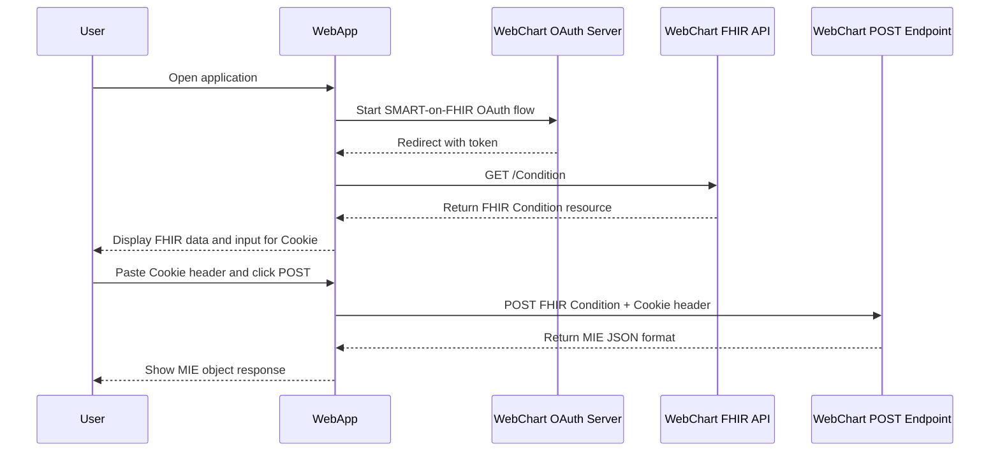

# MIE FHIR TRANSFER APP
## SMART-on-FHIR WebChart Integration – Condition Viewer & Poster

This project is a full-stack SMART-on-FHIR proof-of-concept (POC) that demonstrates authentication, FHIR data retrieval, and transformation pipelines with WebChart EHR. It performs OAuth2 authentication to fetch `Condition` resources and sends them via a POST endpoint, transforming FHIR-standard JSON into WebChart's internal MIE format.

The interface also supports manual insertion of an authentication `Cookie` for authorized write-back via the POST endpoint.

---

## Overview

This POC application:

- Authenticates using **SMART-on-FHIR OAuth2** with WebChart EHR.
- Retrieves **FHIR Condition** resources via the authenticated session.
- Displays the FHIR data in the UI.
- Accepts a `Cookie` header (session ID) to authenticate POST requests.
- Sends the selected FHIR object to the WebChart MIE API.
- Receives the transformed **MIE object format** as a response.

---

## Core Features

- **SMART-on-FHIR Authentication** using OAuth2.
- **FHIR Resource Retrieval** – specifically the `Condition` resource.
- **FHIR ➝ MIE Conversion** via a WebChart POST endpoint.
- Manual header injection using `Cookie` for secure POSTing.
- Configurable endpoints for both OAuth and POST via a single config file.

---

## Tech Stack

- **Meteor + React** frontend framework.
- **Axios** for network calls.
- **OAuth** for secure authentication.
- **Material UI** for UI components.
- **FHIR JSON & MIE JSON** formats.

---

## Setup Instructions

### Prerequisites

- Node.js + Meteor installed.
- A valid WebChart OAuth client and secret.
- Access to the WebChart testing environment:

1. OAuth URL: https://ashwinvagu.webch.art
2. POST testing environment: https://dcarlson.dev.webchart.app/webchart.cgi?func=layout&module=FHIRtools&name=home

The above can be changed if required.

### Configuration

1. Update API Endpoints:
- Edit imports/utils/urls.js:
```js
export const FHIR_OAUTH_URL = "<your-auth-url>";
export const POST_CONDITION_URL = "<your-post-url>";
```

2. Set Up Client Secret:
- Create a file credentials/secrets.js:
```js
export const CLIENT_SECRET = "<your-client-secret>";
```
- If the file is missing, the app will prompt the user to enter the client secret manually.

3.  Run the Application:
```bash
meteor run --port 8080
```
Change the port if needed.


---

## Usage Instructions:

1. Navigate to the web app.
2. Authenticate using the SMART-on-FHIR OAuth2 flow.
3. View the fetched Condition resource.
4. In another browser tab, go to: WebChart POST Tool

- Perform a POST.
- Open Inspect Element > Network Tab > Request Headers.
- Copy the Cookie header (e.g., wc_miehr_wctdcarlson_session_id=...).
For Chrome this can be seen not just in the Network tab, but also in the Application tab.

5. Paste it into the input field on the UI and click POST.
6. The converted MIE object will appear below.

---

## Example FHIR ➝ MIE Transformation

### Input FHIR (POST body):

```json
{
  "resourceType": "Condition",
  "code": { "text": "Atrial fibrillation" },
  "subject": { "reference": "Patient/18" }
}
```

### Response MIE:

```json
{
  "db": {
    "cond_id": "26",
    "description": "Atrial fibrillation",
    "icd10": "I48.91",
    "icd9": "427.31",
    "pat_id": "18"
  }
}
```

---

## Environment variables:

- CLIENT_SECRET: Required for OAuth2 token exchange.
- Endpoints (FHIR_OAUTH_URL, POST_CONDITION_URL) are configurable.


---

## Demo Video:

For a better understanding on how to do this, here is a demo video:
https://www.youtube.com/shorts/72O9XAq9gl8 

---

## 🔁 Workflow – Mermaid Diagram

